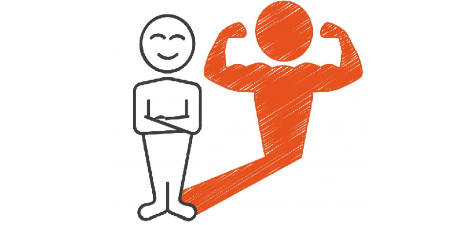
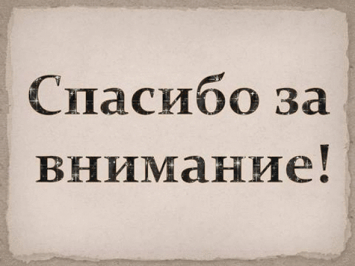

## Немного обо мне

### Кратко о себе:

- Мне `22` года `(07.09.2003)`;
- Студент **СКФ МТУСИ**. Обучаюсь *на втором курсе* по специальности **"Защищённые инфокоммуникационные сети и системы"**;
- Ответственная, трудолюбивая, творческая личность;
- Знаток по *компьютерным сетям* и в *инфобезе* **(документация, криптография, физическая защита, программно-аппаратная защита)**;
- На данный момент, изучаю *веб-программирование, ИИ, data-science*;
- Есть несколько интересных проектов на github (`#Ai` `#telegram_bot` `#SEO` `#web_quest`)

## Навыки и технологии

## Опыт и проекты

### Проект 1 — Название
Краткое описание проекта, что было сделано, технологии и результат.

### Проект 2 — Название
Краткая информация о проекте, ссылки, достижения.

## Образование и сертификаты
- Ваша степень, учебное заведение
- Курсы, сертификаты (например, по информационной безопасности, веб-разработке)

## Контакты
- *Email по работе:* `S73PANOW.WORK@yandex.ru`

- *Telegram:* `@giraffick`

- *VKontakte:* [профиль](https://vk.com/crickette)

---

  

