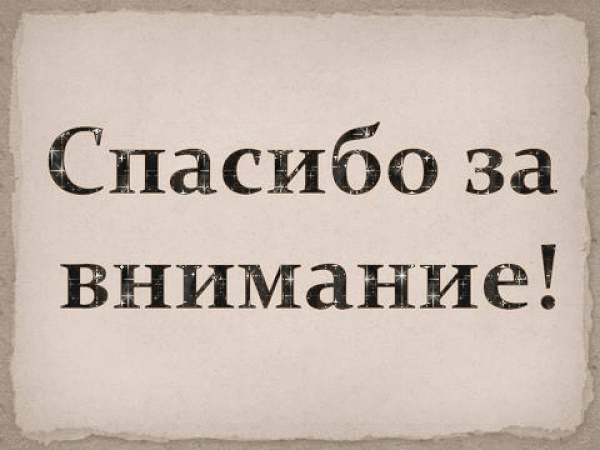

[](https://git.io/typing-svg)

## Немного обо мне


### Кратко о себе:

- Я --> Степанов Роман Сергеевич;
- Мне `22` года `(07.09.2003)`;
- Студент **СКФ МТУСИ**. Обучаюсь *на втором курсе* по специальности **"Защищённые инфокоммуникационные сети и системы"**;
- Ответственная, трудолюбивая, творческая, законопослушная личность;
- Знаток по *компьютерным сетям* и в *инфобезе* **(документация, криптография, физическая защита, программно-аппаратная защита)**;
- На данный момент, изучаю *веб-программирование, ИИ*;
- Разбираюсь в **документировании**, настройке **чистой архитектуры** проекта, **сборке** и **деплое** проектов на виртуальный сервер;
- Есть несколько интересных проектов на github.

## Навыки и технологии

[](https://github.com/Cricko7/github-readme-stats)

- Операционные системы:
  


- Утилиты/программы:
  


- Языки программирования:
  


- Изучаю следующие ЯП:


- СУБД:
  


- Технологии/библиотеки ЯП:
  


- Хостинг проектов:
  


- Сетевые технологии:
  


- Хранение проектов:
  


## Опыт и проекты


### Проект 1 — [Resume Vizor - веб-платформа цифровой верификации дипломов](https://github.com/Cricko7/resum-vizor)

Платформа цифровой верификации дипломов с backend на `Rust` + `Axum`, frontend для пользователей и отдельным `QR-сервисом`.

#### Платформа позволяет:
- вузу загружать дипломы по одному или массово через CSV/XLSX
- хранить чувствительные данные дипломов в хешированном виде
- автоматически подписывать записи дипломов цифровой подписью вуза
- студенту находить и привязывать свои дипломы
- студенту делиться временной ссылкой на диплом
- студенту запрашивать QR-код на свой диплом через отдельный QR-микросервис
- HR/ATS-системам проверять диплом через API
- вузу аннулировать диплом и восстанавливать его обратно

Текущий стек:

- `Rust`
- `Axum`
- `Tokio`
- `SQLx`
- `PostgreSQL`
- `Redis`

`in-memory` persistence сохранен для тестов и быстрых unit/integration-style сценариев.
`Redis` используется для трех production-полезных задач: распределенного rate limiting для machine-to-machine endpoints, response caching для read-heavy verification/search сценариев и кэширования QR-изображений, чтобы не дергать внешний QR-сервис на каждый повторный запрос фронта.

Результат работы:

<details>
<summary>Скриншоты интерфейса</summary>

<p>
  
  
  
</p>
  
</details>

### Проект 2 — Название
Краткая информация о проекте, ссылки, достижения.

## Образование и сертификаты
- Окончил 4 года обучения в РКСИ по специальности "Информационная безопасность в телекоммуникационных системах".

## Контакты
- *Email по работе:*

```
S73PANOW.WORK@yandex.ru
```

- *Telegram:*

```
@giraffick
```

- *VKontakte:* [профиль](https://vk.com/crickette)

---

<div align="center">
  
</div>
